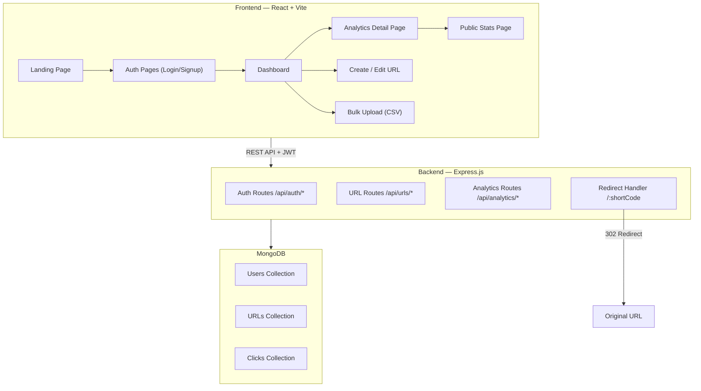

# URL Shortener with Analytics — Full Implementation Plan

> **Hackathon:** Katomaran | **Stack:** MERN (MongoDB · Express.js · React · Node.js)
> **Deadline:** June 4, 2026 — 12:00 PM IST

---

## 1. High-Level Architecture



### Project Structure

```
d:\Project\URL\
├── client/                    # React frontend (Vite)
│   ├── public/
│   ├── src/
│   │   ├── assets/
│   │   ├── components/        # Reusable UI components
│   │   │   ├── ui/            # Buttons, inputs, cards, modals
│   │   │   ├── layout/        # Navbar, Sidebar, Footer
│   │   │   └── charts/        # Chart components
│   │   ├── pages/             # Route-level pages
│   │   │   ├── Landing.jsx
│   │   │   ├── Login.jsx
│   │   │   ├── Signup.jsx
│   │   │   ├── Dashboard.jsx
│   │   │   ├── Analytics.jsx
│   │   │   ├── PublicStats.jsx
│   │   │   └── BulkUpload.jsx
│   │   ├── context/           # Auth context
│   │   ├── hooks/             # Custom hooks
│   │   ├── services/          # API service layer (axios)
│   │   ├── utils/             # Helpers, validators
│   │   ├── App.jsx
│   │   ├── main.jsx
│   │   └── index.css
│   ├── index.html
│   ├── vite.config.js
│   └── package.json
│
├── server/                    # Express backend
│   ├── config/
│   │   └── db.js              # MongoDB connection
│   ├── middleware/
│   │   ├── auth.js            # JWT verification
│   │   └── validate.js        # Request validation
│   ├── models/
│   │   ├── User.js
│   │   ├── Url.js
│   │   └── Click.js
│   ├── routes/
│   │   ├── auth.js
│   │   ├── urls.js
│   │   ├── analytics.js
│   │   └── redirect.js
│   ├── controllers/
│   │   ├── authController.js
│   │   ├── urlController.js
│   │   └── analyticsController.js
│   ├── utils/
│   │   ├── generateCode.js
│   │   └── validators.js
│   ├── server.js              # Entry point
│   ├── .env
│   └── package.json
│
├── README.md
└── .gitignore
```

---

## 2. Database Schema Design

### Users Collection

| Field        | Type     | Notes                     |
|-------------|----------|---------------------------|
| `_id`       | ObjectId | Auto-generated            |
| `name`      | String   | Required                  |
| `email`     | String   | Required, unique, indexed |
| `password`  | String   | Hashed (Optional for OAuth)|
| `googleId`  | String   | Google OAuth ID (Optional)|
| `createdAt` | Date     | Auto (timestamps)         |

### URLs Collection

| Field         | Type     | Notes                                     |
|--------------|----------|-------------------------------------------|
| `_id`        | ObjectId | Auto-generated                            |
| `userId`     | ObjectId | Ref → Users, indexed                      |
| `originalUrl`| String   | Required, validated                       |
| `shortCode`  | String   | Required, unique, indexed                 |
| `customAlias`| String   | Optional (bonus)                          |
| `clickCount` | Number   | Default: 0, incremented on each redirect  |
| `expiresAt`  | Date     | Optional (bonus), null = never expires    |
| `isActive`   | Boolean  | Default: true                             |
| `createdAt`  | Date     | Auto (timestamps)                         |
| `updatedAt`  | Date     | Auto (timestamps)                         |

### Clicks Collection (Analytics)

| Field       | Type     | Notes                              |
|------------|----------|------------------------------------|
| `_id`      | ObjectId | Auto-generated                     |
| `urlId`    | ObjectId | Ref → URLs, indexed                |
| `timestamp`| Date     | Default: Date.now                  |
| `ip`       | String   | Visitor IP (for geo, anonymized)   |
| `userAgent`| String   | Raw UA string                      |
| `browser`  | String   | Parsed browser name (bonus)        |
| `os`       | String   | Parsed OS name (bonus)             |
| `device`   | String   | desktop / mobile / tablet (bonus)  |
| `country`  | String   | From IP geo-lookup (bonus)         |
| `city`     | String   | From IP geo-lookup (bonus)         |
| `referrer` | String   | HTTP Referer header                |

---

## 3. REST API Design

### Auth Endpoints

| Method | Endpoint            | Auth | Description            |
|--------|---------------------|------|------------------------|
| POST   | `/api/auth/signup`  | No   | Register a new user    |
| POST   | `/api/auth/login`   | No   | Login, sets HTTP cookie|
| POST   | `/api/auth/google`  | No   | Google OAuth login     |
| POST   | `/api/auth/logout`  | No   | Clear auth cookie      |
| GET    | `/api/auth/me`      | Yes  | Get current user info  |

### URL Endpoints

| Method | Endpoint              | Auth | Description                        |
|--------|-----------------------|------|------------------------------------|
| POST   | `/api/urls`           | Yes  | Create a new short URL             |
| GET    | `/api/urls`           | Yes  | Get all URLs for logged-in user    |
| GET    | `/api/urls/:id`       | Yes  | Get single URL details             |
| PUT    | `/api/urls/:id`       | Yes  | Edit destination URL (bonus)       |
| DELETE | `/api/urls/:id`       | Yes  | Delete a short URL                 |
| POST   | `/api/urls/bulk`      | Yes  | Bulk create from CSV (bonus)       |

### Analytics Endpoints

| Method | Endpoint                       | Auth | Description                        |
|--------|--------------------------------|------|------------------------------------|
| GET    | `/api/analytics/:urlId`        | Yes  | Full analytics for a URL           |
| GET    | `/api/analytics/:urlId/clicks` | Yes  | Paginated click history            |
| GET    | `/api/analytics/:urlId/daily`  | Yes  | Daily click aggregation (bonus)    |

### Redirect & Public Endpoints

| Method | Endpoint                   | Auth | Description                         |
|--------|----------------------------|------|-------------------------------------|
| GET    | `/:shortCode`              | No   | Redirect to original URL + log click|
| GET    | `/api/public/:shortCode`   | No   | Public stats page data (bonus)      |

---

## 4. Technology & Libraries

### Backend (`server/`)

| Purpose              | Package                 | Reason                                    |
|----------------------|-------------------------|-------------------------------------------|
| Framework            | `express`               | Required by problem statement             |
| Database ODM         | `mongoose`              | MongoDB object modeling                   |
| Auth tokens          | `jsonwebtoken`          | JWT generation & verification             |
| Password hashing     | `bcryptjs`              | Hash passwords (mandatory)                |
| Google OAuth         | `google-auth-library`   | Verify Google ID tokens                   |
| Cookie parsing       | `cookie-parser`         | HTTP-only cookies for auth                |
| Validation           | `express-validator`     | Backend validation (mandatory)            |
| Environment vars     | `dotenv`                | Config via env vars (mandatory)           |
| CORS                 | `cors`                  | Cross-origin requests from frontend       |
| User Agent parsing   | `ua-parser-js`          | Device/browser analytics (bonus)          |
| IP Geolocation       | `geoip-lite`            | Country/city from IP (bonus, offline DB)  |
| QR Code              | `qrcode`                | QR generation (bonus)                     |
| CSV parsing          | `csv-parse`             | Bulk upload parsing (bonus)               |
| File upload          | `multer`                | CSV file upload handling (bonus)          |
| Unique IDs           | `nanoid`                | Short code generation                     |

### Frontend (`client/`)

| Purpose              | Package                         | Reason                             |
|----------------------|---------------------------------|------------------------------------|
| Build tool           | `vite`                          | Fast dev server & build            |
| UI Framework         | `react` + `react-dom`           | Required by problem statement      |
| Routing              | `react-router-dom`              | Client-side routing                |
| HTTP client          | `axios`                         | API calls                          |
| Google OAuth         | `@react-oauth/google`           | Google Login component             |
| Charts               | `recharts`                      | Click trend charts (bonus)         |
| Icons                | `lucide-react`                  | Modern icon set                    |
| Notifications        | `react-hot-toast`               | Toast notifications                |
| Date formatting      | `date-fns`                      | Human-readable dates               |
| QR display           | `react-qr-code`                 | QR code rendering (bonus)          |
| Copy to clipboard    | `react-copy-to-clipboard`       | Copy short URL (mandatory)         |
| CSV export           | Built-in                        | No extra lib needed                |

---

## 5. Implementation Phases

### Phase 1 — Project Scaffolding & Backend Foundation
> **Goal:** Get both projects initialized, database connected, and auth working.

#### Step 1.1 — Initialize Projects
- Create `server/` with `npm init -y`
- Install all backend dependencies
- Create `client/` with `npx create-vite@latest` (React template)
- Install all frontend dependencies
- Setup `.env` files and `.gitignore`

#### Step 1.2 — Database Connection & Models
- [server/config/db.js](file:///d:/Project/URL/server/config/db.js) — MongoDB connection with Mongoose
- [server/models/User.js](file:///d:/Project/URL/server/models/User.js) — User schema with pre-save bcrypt hook
- [server/models/Url.js](file:///d:/Project/URL/server/models/Url.js) — URL schema with indexes
- [server/models/Click.js](file:///d:/Project/URL/server/models/Click.js) — Click/analytics schema

#### Step 1.3 — Authentication System (Cookie-based + Google OAuth)
- [server/middleware/auth.js](file:///d:/Project/URL/server/middleware/auth.js) — JWT verification middleware via HttpOnly cookies
- [server/controllers/authController.js](file:///d:/Project/URL/server/controllers/authController.js) — signup, login, googleLogin, logout, getMe
- [server/routes/auth.js](file:///d:/Project/URL/server/routes/auth.js) — Auth routes
- [server/utils/validators.js](file:///d:/Project/URL/server/utils/validators.js) — Express-validator chains
- Password hashing via bcryptjs (for traditional login)
- JWT token stored in an HttpOnly, secure cookie
- Google OAuth integration using `google-auth-library`

---

### Phase 2 — Core URL Shortening Backend
> **Goal:** Full CRUD for URLs + redirect with click tracking.

#### Step 2.1 — URL CRUD
- [server/controllers/urlController.js](file:///d:/Project/URL/server/controllers/urlController.js):
  - `createUrl` — Validate URL format, generate unique 7-char short code via `nanoid`, save to DB
  - `getUserUrls` — Fetch all URLs for authenticated user, sorted by creation date
  - `getUrlById` — Single URL with ownership check
  - `deleteUrl` — Soft or hard delete with ownership check
- [server/routes/urls.js](file:///d:/Project/URL/server/routes/urls.js) — Protected URL routes
- URL validation: must be a valid HTTP/HTTPS URL (backend + frontend)

#### Step 2.2 — Redirect Handler & Click Logging
- [server/routes/redirect.js](file:///d:/Project/URL/server/routes/redirect.js):
  - `GET /:shortCode` → Lookup URL in DB → Log click to Clicks collection → Increment `clickCount` → **302 redirect** to `originalUrl`
  - If short code not found → 404 page
  - If link expired → 410 Gone page
- Click logging captures: timestamp, IP, user-agent, referrer
- Server-side redirect (mandatory — not client-side)

#### Step 2.3 — Analytics Controller
- [server/controllers/analyticsController.js](file:///d:/Project/URL/server/controllers/analyticsController.js):
  - `getAnalytics` — Total clicks, last visited time, recent visit history
  - `getClickHistory` — Paginated list of all clicks
  - `getDailyClicks` — MongoDB aggregation pipeline grouping by day (bonus)
- [server/routes/analytics.js](file:///d:/Project/URL/server/routes/analytics.js) — Protected analytics routes

#### Step 2.4 — Wire Up Server Entry Point
- [server/server.js](file:///d:/Project/URL/server/server.js):
  - Connect to MongoDB
  - Apply middleware (cors, json parser, etc.)
  - Mount route groups
  - **Important:** Mount `/:shortCode` redirect AFTER `/api/*` routes to avoid conflicts
  - Error handling middleware

---

### Phase 3 — Frontend Foundation & Auth UI
> **Goal:** Beautiful landing page, auth flow, protected routing.

#### Step 3.1 — Design System & Global Styles
- [client/src/index.css](file:///d:/Project/URL/client/src/index.css):
  - CSS custom properties (colors, spacing, typography, shadows, radii)
  - Dark theme with vibrant accent colors (deep purple/blue gradient palette)
  - Glassmorphism card styles
  - Responsive breakpoints
  - Smooth transitions & micro-animations
  - Import Google Font: **Inter** (modern, clean)

#### Step 3.2 — Layout Components
- `Navbar` — Logo, nav links, auth state, logout button
- `Footer` — Simple footer with credits
- `ProtectedRoute` — Wrapper that redirects to login if not authenticated

#### Step 3.3 — Auth Context & Service Layer
- [client/src/context/AuthContext.jsx](file:///d:/Project/URL/client/src/context/AuthContext.jsx) — Auth state, login/signup/logout actions, Google Login support, cookie-based sessions.
- [client/src/services/api.js](file:///d:/Project/URL/client/src/services/api.js) — Axios instance configured with `withCredentials: true`
- [client/src/services/authApi.js](file:///d:/Project/URL/client/src/services/authApi.js) — login, signup, google login API calls

#### Step 3.4 — Auth Pages
- [client/src/pages/Login.jsx](file:///d:/Project/URL/client/src/pages/Login.jsx) — Login form with Google OAuth button
- [client/src/pages/Signup.jsx](file:///d:/Project/URL/client/src/pages/Signup.jsx) — Registration form with Google OAuth button
- Both pages: loading states, success/error toasts, redirect on success

#### Step 3.5 — Landing Page
- [client/src/pages/Landing.jsx](file:///d:/Project/URL/client/src/pages/Landing.jsx):
  - Hero section with animated gradient background
  - Feature highlights (cards with icons)
  - CTA buttons to signup/login
  - Responsive and visually stunning

---

### Phase 4 — Dashboard & URL Management UI
> **Goal:** Full dashboard with URL creation, listing, deletion, and copy functionality.

#### Step 4.1 — Dashboard Page
- [client/src/pages/Dashboard.jsx](file:///d:/Project/URL/client/src/pages/Dashboard.jsx):
  - Stats summary cards at top (total URLs, total clicks, active links)
  - "Create New URL" button/modal
  - URL list/table with columns: Original URL (truncated), Short URL (clickable), Created Date, Clicks, Actions
  - Actions per row: Copy, View Analytics, Delete
  - Empty state with illustration
  - Loading skeleton states

#### Step 4.2 — Create URL Modal/Form
- URL input with real-time validation
- Optional custom alias field (bonus)
- Optional expiry date picker (bonus)
- Submit → show generated short URL with copy button
- Success animation

#### Step 4.3 — URL Card/Row Component
- Responsive card layout (grid on desktop, stack on mobile)
- Copy-to-clipboard with visual feedback
- Delete with confirmation modal
- Click count badge
- Link to analytics detail page

---

### Phase 5 — Analytics UI
> **Goal:** Rich analytics page for each shortened URL.

#### Step 5.1 — Analytics Detail Page
- [client/src/pages/Analytics.jsx](file:///d:/Project/URL/client/src/pages/Analytics.jsx):
  - Header: Original URL, Short URL, creation date
  - Stats cards: Total clicks, Last visited, Unique visitors
  - Recent visit history table (timestamp, browser, OS, device, location)
  - Click trend chart — line/bar chart showing clicks per day (Recharts)
  - Device/Browser breakdown pie charts (bonus)
  - Geographic distribution (bonus)

---

### Phase 6 — Bonus Features (Implement After Core is Complete)
> **Goal:** Add all bonus features to maximize hackathon score.

#### 6.1 — Custom Alias for Short URL ⭐
- Add optional `customAlias` field in create URL form
- Backend: Check uniqueness, validate characters (alphanumeric + hyphens)
- Use custom alias as `shortCode` if provided

#### 6.2 — QR Code Generation ⭐
- Backend: `/api/urls/:id/qr` endpoint using `qrcode` package → returns PNG/SVG
- Frontend: Display QR code in analytics page + download button
- Also show QR in a modal from dashboard

#### 6.3 — Expiry Date for Links ⭐
- Add optional date picker in create URL form
- Backend: Check expiry on redirect → return 410 Gone if expired
- Dashboard: Show expiry badge / "Expired" tag
- Allow clearing expiry (make permanent)

#### 6.4 — Geolocation & Device/Browser Analytics ⭐
- Backend: Parse User-Agent with `ua-parser-js` → store browser, OS, device type
- Backend: IP geolocation with `geoip-lite` → store country, city
- Frontend: Pie charts for browser/OS/device breakdown
- Frontend: Country-level distribution list/chart

#### 6.5 — Charts for Daily Click Trends ⭐
- Backend: MongoDB aggregation pipeline grouping clicks by date
- Frontend: Line chart with Recharts showing last 30 days of clicks
- Date range filter (7d / 30d / all time)

#### 6.6 — Public Stats Page ⭐
- `GET /api/public/:shortCode` — Returns limited analytics (total clicks, created date)
- [client/src/pages/PublicStats.jsx](file:///d:/Project/URL/client/src/pages/PublicStats.jsx) — Public page showing basic stats
- No auth required, accessible via `/:shortCode/stats` or `/:shortCode+`
- Toggle in dashboard to enable/disable public stats per link

#### 6.7 — Edit Destination URL ⭐
- PUT endpoint already planned
- Dashboard: Edit button → inline edit or modal
- Backend: Validate new URL, update `originalUrl`

#### 6.8 — Bulk URL Shortening via CSV ⭐
- [client/src/pages/BulkUpload.jsx](file:///d:/Project/URL/client/src/pages/BulkUpload.jsx):
  - File upload (CSV format: `url, customAlias (optional)`)
  - Preview table before submission
  - Progress bar during processing
  - Download results as CSV (short URLs mapped to originals)
- Backend: `POST /api/urls/bulk` with `multer` + `csv-parse`

---

## 6. UI Design Direction

### Color Palette (Dark Theme)

| Token              | Value                 | Usage                        |
|--------------------|-----------------------|------------------------------|
| `--bg-primary`     | `#0a0a0f`             | Main background              |
| `--bg-secondary`   | `#12121a`             | Card/panel backgrounds       |
| `--bg-glass`       | `rgba(255,255,255,0.05)` | Glassmorphism panels      |
| `--accent-primary` | `#7c3aed`             | Purple accent (buttons, links)|
| `--accent-secondary`| `#3b82f6`            | Blue accent (secondary CTA)  |
| `--accent-gradient` | `linear-gradient(135deg, #7c3aed, #3b82f6)` | Gradient fills |
| `--text-primary`   | `#f1f5f9`             | Primary text                 |
| `--text-secondary` | `#94a3b8`             | Secondary/muted text         |
| `--success`        | `#10b981`             | Success states               |
| `--error`          | `#ef4444`             | Error states                 |
| `--warning`        | `#f59e0b`             | Warning states               |
| `--border`         | `rgba(255,255,255,0.08)` | Subtle borders            |

### Design Elements
- **Glassmorphism** cards with `backdrop-filter: blur()`
- **Gradient** hero sections and accent elements
- **Micro-animations**: hover scale on cards, button press effects, loading skeletons, number count-up animations
- **Typography**: Inter font, proper hierarchy (48px hero → 14px body)
- **Responsive**: Mobile-first, breakpoints at 640px, 768px, 1024px

---

## 7. Security Considerations

- Passwords hashed with **bcryptjs** (salt rounds: 12)
- JWT stored in HttpOnly cookies to prevent XSS attacks
- JWT expiry: 1 day
- **Google OAuth** for secure third-party sign-in
- **Rate limiting** on auth routes and redirect endpoint
- Input sanitization on all endpoints
- URL validation: reject non-HTTP/HTTPS protocols, check for malicious URLs
- MongoDB injection prevention via Mongoose schema validation
- CORS configured to allow only frontend origin
- Environment variables for all secrets (JWT_SECRET, MONGO_URI, PORT)

---

## 8. Verification Plan

### Automated Testing
- Test all API endpoints manually via the browser subagent
- Verify redirect works correctly (302 status + click logging)
- Verify auth flow (signup → login → access dashboard → logout)
- Verify URL CRUD operations
- Verify analytics data accuracy

### Manual Verification
- Responsive design testing (desktop, tablet, mobile viewports)
- Error state testing (invalid URLs, duplicate aliases, expired links)
- Cross-browser compatibility check
- Loading state verification

### Build Verification
- `npm run build` in client — ensure no build errors
- Production build preview
- Environment variable validation on startup

---

## 9. README.md Structure

The final README will include:
1. **Project Title & Description**
2. **Setup Instructions** (prerequisites, clone, install, env setup, run)
3. **Assumptions Made**
4. **AI Planning Document** (this plan)
5. **Architecture Diagram** (Mermaid rendered or image)
6. **Features List** (mandatory ✅ + bonus ⭐)
7. **API Documentation** (endpoints table)
8. **Tech Stack**
9. **Sample Output** (screenshots, logs, DB entries)
10. **Video Link** (Loom/YouTube placeholder)
11. **Hackathon Attribution** — "This project is a part of a hackathon run by https://katomaran.com"

---

## 10. Execution Order Summary

| # | Phase | Deliverable | Priority |
|---|-------|-------------|----------|
| 1 | Scaffolding + DB + Auth Backend | Working auth API | 🔴 Critical |
| 2 | URL CRUD + Redirect + Analytics Backend | Full backend API | 🔴 Critical |
| 3 | Frontend Auth + Landing Page | Auth flow working | 🔴 Critical |
| 4 | Dashboard + URL Management UI | Core app usable | 🔴 Critical |
| 5 | Analytics UI + Charts | Analytics visible | 🔴 Critical |
| 6a | Custom Alias | Enhanced creation | 🟡 Bonus |
| 6b | QR Code Generation | QR codes working | 🟡 Bonus |
| 6c | Link Expiry | Expiry working | 🟡 Bonus |
| 6d | Geo/Device Analytics | Rich analytics | 🟡 Bonus |
| 6e | Click Trend Charts | Visual trends | 🟡 Bonus |
| 6f | Public Stats Page | Public sharing | 🟡 Bonus |
| 6g | Edit Destination URL | Edit working | 🟡 Bonus |
| 6h | Bulk CSV Upload | Bulk creation | 🟡 Bonus |
| 7 | README + Documentation | Submission ready | 🔴 Critical |

---

> [!IMPORTANT]
> **Deadline reminder:** Submission is due **June 4, 2026 at 12:00 PM IST**. That gives us approximately **2.5 days** to build, test, and document everything. The plan is structured so that all **mandatory features are completed first** (Phases 1–5), with bonus features added incrementally in Phase 6.

> [!NOTE]
> **Video requirement:** The problem statement explicitly states that submissions without an explanatory video will **not be reviewed**. You'll need to record a Loom/YouTube walkthrough after the app is complete.
